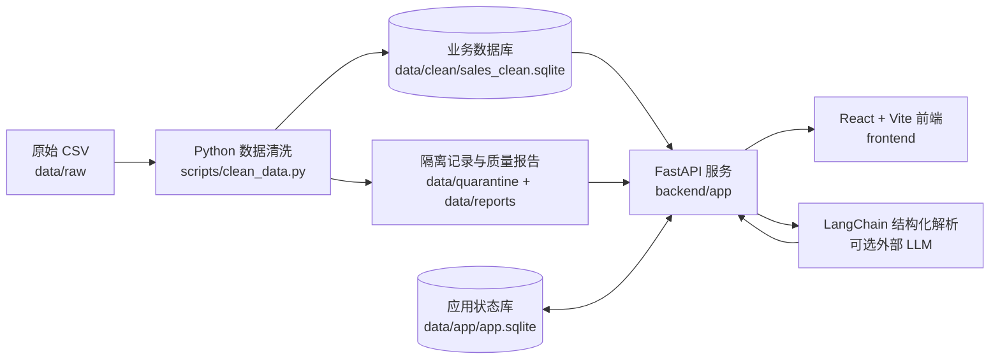

# Moneki 门店经营数据中心

Moneki 是一个面向连锁门店经营分析的全栈示例项目。系统将原始销售 CSV 清洗并写入 SQLite，通过 FastAPI 提供可信聚合接口，再由 React 看板呈现销售趋势、门店对比、商品结构、数据质量、运营告警和日报。项目还提供带上下文追问的 AI 数据问答；模型只负责解析意图和组织语言，业务数字始终由后端白名单查询从 SQLite 获取并校验。

> 当前项目定位为本地演示与技术作业，不代表已经完成生产部署。

## 功能概览

- **数据清洗**：校验销售、门店和商品数据，去重并隔离异常记录，输出清洗报告。
- **经营看板**：展示净营业额、订单数、客单价、日趋势和畅销商品。
- **进阶分析**：支持周期对比、门店排名与诊断、商品结构及衰退预警。
- **数据质量**：展示清洗状态、历史运行、异常指标和已读状态。
- **运营日报**：生成不可变日报版本，并导出 CSV、XLSX 和 PDF。
- **AI 问答**：支持连续追问、对话管理、看板深链和无 API Key 本地降级。
- **权限审计**：提供管理员、区域经理、店长和只读访客四类角色，实施门店范围隔离并记录关键操作。

## 系统架构



AI 不执行任意 SQL，也不直接计算业务指标。查询计划经过白名单服务执行，最终回答中的数字会与后端事实集校验；模型不可用或校验失败时，系统返回本地可信模板。

## 技术栈

| 层级 | 技术 |
|---|---|
| 前端 | React、TypeScript、Vite、ECharts、Lucide React |
| 后端 | Python、FastAPI、Uvicorn、Pydantic |
| AI | LangChain Core、LangChain OpenAI、规则解析与本地降级 |
| 数据 | CSV、SQLite |
| 测试 | pytest、FastAPI TestClient、unittest |

后端 Python 依赖均在 [`backend/requirements.txt`](backend/requirements.txt) 中固定版本；前端解析版本记录在 [`frontend/package-lock.json`](frontend/package-lock.json) 中。

## 项目结构

```text
.
├── backend/              # FastAPI 应用、业务服务、AI 模块和后端测试
├── frontend/             # React/Vite 看板与 API 客户端
├── scripts/              # CSV 数据清洗脚本
├── tests/                # 数据清洗测试
├── data/
│   ├── raw/              # 原始 CSV
│   ├── clean/            # 清洗后的业务 SQLite
│   ├── app/              # 用户、会话、审计等应用状态
│   ├── quarantine/       # 异常隔离记录
│   └── reports/          # 清洗及 AI 真值验证报告
├── doc/                  # 设计计划、项目进度与变更记录
├── AI_USAGE.md           # AI 使用、边界和验收说明
└── demo.md               # AI 连续问答与数字核验示例
```

## 快速开始

### 1. 环境要求

- Python `>= 3.14`（以 [`pyproject.toml`](pyproject.toml) 为准）
- Node.js 与 npm（建议使用当前 LTS 版本）
- PowerShell（以下命令以 Windows 为例）

### 2. 清洗数据

在项目根目录执行：

```powershell
python scripts/clean_data.py
```

主要产物包括：

- `data/clean/sales_clean.sqlite`：后端唯一的销售业务数据源。
- `data/quarantine/quarantine.csv`：未通过校验的记录。
- `data/reports/cleaning_report.json`：清洗指标与异常统计。

### 3. 启动后端

```powershell
cd backend
if (-not (Test-Path .env)) { Copy-Item .env.example .env }
python -m venv .venv
.\.venv\Scripts\Activate.ps1
python -m pip install -r requirements.txt
uvicorn app.main:app --reload --port 8000
```

后端启动后可访问：

- 健康检查：<http://127.0.0.1:8000/health>
- Swagger API 文档：<http://127.0.0.1:8000/docs>

### 4. 启动前端

打开另一个 PowerShell 终端：

```powershell
cd frontend
if (-not (Test-Path .env)) { Copy-Item .env.example .env }
npm install
npm run dev
```

访问 <http://127.0.0.1:5173>。Vite 会将 `/api` 请求代理到 `http://127.0.0.1:8000`；如需使用其他后端地址，可在启动前设置 `VITE_API_PROXY`。

> 未显式设置 `VITE_USE_MOCK=false` 时，看板分析数据默认使用前端模拟数据；登录和 AI 等接口仍需要后端服务。

## 演示账号

首次启动后端时会创建以下本地演示账号：

| 角色 | 用户名 | 默认密码 | 数据范围 |
|---|---|---|---|
| 系统管理员 | `admin` | `admin-demo` | 全部门店 |
| 区域经理 | `region` | `region-demo` | S01、S02、S03 |
| 门店店长 | `manager` | `manager-demo` | S01 |
| 只读访客 | `readonly` | `readonly-demo` | S01、S02 |

这些密码仅供本地演示。首次初始化前可通过 `MONEKI_ADMIN_PASSWORD`、`MONEKI_REGION_PASSWORD`、`MONEKI_MANAGER_PASSWORD` 和 `MONEKI_READONLY_PASSWORD` 覆盖默认值。

## 配置 AI 问答

AI 问答页面位于 <http://127.0.0.1:5173/assistant>。不配置 API Key 时，系统会使用本地规则解析和可信模板回答。若要连接兼容 OpenAI 接口的模型，先复制模板并编辑生成的 `backend/.env`：

```powershell
if (-not (Test-Path backend/.env)) { Copy-Item backend/.env.example backend/.env }
```

变量说明见 [`backend/.env.example`](backend/.env.example)，前端模板见 [`frontend/.env.example`](frontend/.env.example)。修改后重启对应服务。模板可以提交到 Git，但请勿将真实密钥写入任何已跟踪文件。

## 运行测试

数据清洗测试：

```powershell
python -m unittest discover -s tests -v
```

后端测试：

```powershell
cd backend
.\.venv\Scripts\python.exe -m pytest tests -q
```

前端生产构建：

```powershell
cd frontend
npm run build
```

## 相关文档

- [AI 使用说明](AI_USAGE.md)
- [AI 问答 Demo](demo.md)
- [前后端搭建计划](doc/前后端搭建计划.md)
- [功能增强计划](doc/添加功能计划书.md)
- [项目进度](doc/PROJECT_PROGRESS.md)
- [项目修改记录](doc/PROJECT_CHANGELOG.md)

## 当前限制

- 使用本地 SQLite，尚未提供生产数据库迁移、高可用或备份方案。
- 前端依赖在 `package.json` 中使用 `latest` 范围，复现安装应保留并使用现有锁文件。
- 默认账号和密码仅适用于本地演示，部署前必须替换并补充正式的密钥管理策略。
- 项目当前未声明开源许可证。
