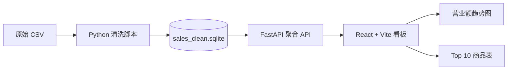

# 门店销售数据看板前后端搭建计划

## 1. 目标与边界

本阶段基于 `data/clean/sales_clean.sqlite` 搭建数据看板：前端提供日期筛选、营业额趋势图和 Top 10 商品表；后端按日期区间返回每日营业额、订单数与客单价。

清洗数据库是唯一业务数据源。后端不得重新解析原始 CSV；前端不得自行计算业务指标。



## 2. 技术选型和目录

| 层 | 技术 | 职责 |
|---|---|---|
| 数据 | SQLite | 读取已清洗的销售事实表 |
| 后端 | Python 3.11、FastAPI、Uvicorn | 校验日期参数、执行参数化 SQL、返回 JSON |
| 前端 | React 18、TypeScript、Vite、ECharts | 筛选、请求、图表和排行表展示 |
| 测试 | pytest、FastAPI TestClient、Vitest | 接口聚合及筛选、页面加载和错误状态 |

计划目录：

```text
backend/
  app/
    main.py              FastAPI 应用与路由
    database.py          SQLite 只读连接
    schemas.py           Pydantic 响应模型
    services/analytics.py 参数化聚合查询
  requirements.txt
  tests/
frontend/
  src/
    api/client.ts        API 客户端和类型
    components/          日期筛选、KPI、趋势图、Top 商品表
    pages/Dashboard.tsx  看板页面与筛选状态
  package.json
  vite.config.ts
```

## 3. 后端 API 合同

统一前缀为 `/api/v1`，所有响应使用 JSON。服务读取项目根目录的 `data/clean/sales_clean.sqlite`；数据库文件不存在时启动失败并提示先执行清洗命令。

### 公共筛选参数

所有分析接口都接受：

| 参数 | 类型 | 必填 | 规则 |
|---|---|---:|---|
| `start_date` | `YYYY-MM-DD` | 否 | 默认有效数据最早日期 |
| `end_date` | `YYYY-MM-DD` | 否 | 默认有效数据最晚日期 |
| `store_id` | string | 否 | 暂支持单门店筛选 |

`start_date` 晚于 `end_date`、日期格式非法或门店 ID 不存在时返回 `422`。筛选无数据返回 `200` 与零值或空数组。

### 接口清单

| 方法和路径 | 说明 | `data` 返回值 |
|---|---|---|
| `GET /health` | 服务与清洗数据库可用性 | `{ "status": "ok" }` |
| `GET /api/v1/filters` | 前端初始化筛选项 | `{ "date_min", "date_max", "stores" }` |
| `GET /api/v1/dashboard/summary` | 看板 KPI | `{ "net_revenue", "order_count", "average_order_value" }` |
| `GET /api/v1/dashboard/daily` | 每日趋势 | `[{ "date", "net_revenue", "order_count", "average_order_value" }]` |
| `GET /api/v1/dashboard/top-products` | 商品前十 | `[{ "rank", "product_id", "product_name", "product_category", "net_revenue", "quantity", "order_count" }]` |

接口的统一外壳：

```json
{
  "filters": {
    "start_date": "2026-05-01",
    "end_date": "2026-07-31",
    "store_id": null
  },
  "data": {}
}
```

统计口径严格复用清洗计划：

- 营业额：`SUM(amount_clean)`，负数记录计入净营业额。
- 订单数：`COUNT(DISTINCT order_id)`。
- 客单价：营业额除以订单数；无订单时返回 `0`。
- Top 商品：以 `net_revenue DESC` 排序，最多返回 10 条；金额相同时按商品 ID 升序保证结果稳定。

## 4. 前端交互与页面结构

首屏为运营看板，而非介绍页：

```text
页面标题和数据日期范围
日期范围筛选 | 门店筛选 | 重置
营业额 KPI | 订单数 KPI | 客单价 KPI
营业额趋势图
Top 10 商品表
```

交互规则：

- 初始加载 `/filters`，采用 API 返回的完整日期范围。
- 用户点击“查询”后，并行请求 `summary`、`daily` 和 `top-products`。
- 筛选改变后不展示旧筛选条件下的数据；请求期间显示局部加载状态。
- 日期非法时在筛选控件旁展示校验错误，不发请求。
- API 返回空数据时，KPI 显示 `¥0.00`、`0`、`¥0.00`，图表和表格显示空状态。
- 接口请求失败时展示重试操作与服务错误信息，不伪造业务数字。

视觉实现采用 ECharts 折线/面积图展示日营业额；Top 10 表固定列为排名、商品、品类、销售额、销量、订单数。货币统一为 `¥` 和两位小数，数量和订单数为整数。

## 5. 实施顺序与验收

1. 初始化 `backend`，实现 SQLite 只读依赖、Pydantic 模型和五个接口。
2. 为每个聚合接口编写 API 测试，校验日期边界、空区间、负数金额、门店筛选和 Top 10 排序。
3. 初始化 `frontend`，实现 API 客户端、筛选状态、KPI、趋势图和 Top 10 表。
4. 配置 Vite 代理，将 `/api` 转发到 `http://127.0.0.1:8000`，开发环境不需要 CORS 配置。
5. 完成前端测试和生产构建验证。

验收标准：

- 后端按日期区间返回每日营业额、订单数和客单价，且与 `sales_clean` 聚合结果一致。
- 前端可筛选日期区间并同步刷新 KPI、趋势图和 Top 10 表。
- Top 商品表永远最多展示 10 条，商品维度均来自已清洗 JOIN 数据。
- 后端和前端均能处理无数据、参数非法和数据库不可用的状态。
- 清洗、后端测试、前端测试和前端生产构建均通过。

## 6. 启动约定

完成搭建后的本地开发命令：

```powershell
# 终端 1：生成或刷新清洗数据库并启动 API
python scripts/clean_data.py
cd backend
python -m venv .venv
.\.venv\Scripts\Activate.ps1
pip install -r requirements.txt
uvicorn app.main:app --reload --port 8000

# 终端 2：启动 React 前端
cd frontend
npm install
npm run dev
```

浏览器访问 Vite 输出的本地地址，通常为 `http://127.0.0.1:5173`；FastAPI 文档地址为 `http://127.0.0.1:8000/docs`。
