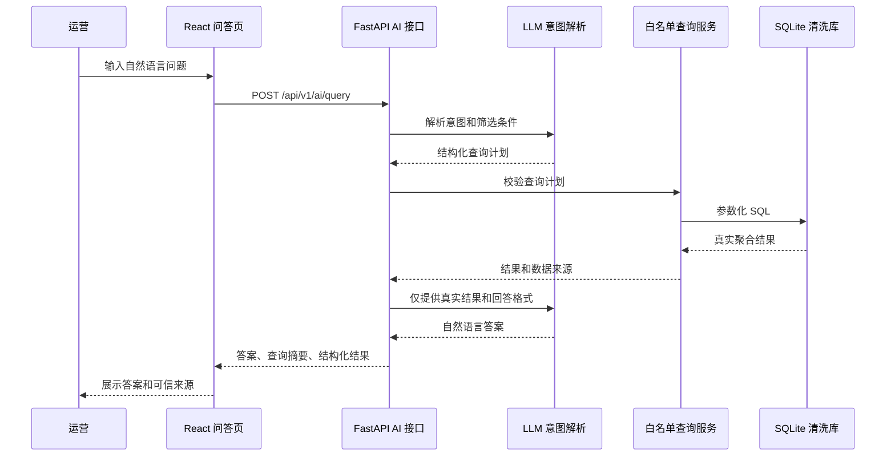

# AI 数据问答功能计划书

## 1. 目标与边界

在现有 React 数据看板中增加 AI 问答页面。运营可以用自然语言询问营业额、订单、客单价、门店、商品和品类问题；系统必须先从 `data/clean/sales_clean.sqlite` 查询真实数字，再由大模型组织答案。

本阶段包含：

- 问答页面和对话列表。
- 新建、切换、删除对话。
- 多轮上下文，例如“那五月呢？”。
- 日期、门店、商品和品类相关的第一版数据问题。
- 无法回答、无数据、AI 服务不可用时的明确兜底。
- 对真实查询结果和回答数字的自动化校验。

本阶段不包含：用户登录、多人协作、消息点赞、文件上传、修改业务数据和模型直接访问数据库。

## 2. 可信问答架构

大模型不能直接读取 CSV、SQLite 或查询结果以外的原始文本。所有数字必须经过后端查询函数获得。



关键约束：

- LLM 只负责意图解析和语言表达，不负责计算数字。
- 后端只执行白名单指标和维度，不执行模型返回的任意 SQL。
- 最终响应保留结构化 `facts`，前端展示“查询条件”和“数据来源”。
- 若模型答案中的数字无法与 `facts` 对齐，后端丢弃模型文本，改用模板答案并记录校验失败。

## 3. 支持的问题范围

第一版支持以下意图：

| 意图 | 示例 | 查询结果 |
|---|---|---|
| `revenue_by_period` | “六月营业额是多少？” | 营业额、日期范围 |
| `orders_by_period` | “七月有多少订单？” | 去重订单数、日期范围 |
| `aov_by_period` | “最近客单价是多少？” | 营业额、订单数、客单价 |
| `daily_trend` | “五月每天营业额怎么样？” | 每日营业额、订单数、客单价 |
| `product_revenue` | “牛肉poke 六月卖了多少钱？” | 商品销售额、销量、订单数 |
| `top_products` | “哪个商品卖得最好？” | Top 商品排行 |
| `store_revenue` | “哪个门店营业额最高？” | 门店营业额排行 |
| `category_revenue` | “哪个品类的营业额最高？” | 商品品类营业额排行 |
| `aov_trend` | “客单价最近是涨了还是跌了？” | 区间前后客单价和趋势 |
| `follow_up` | “那五月呢？” | 继承上轮主题，仅更新时间或筛选条件 |

第一版不支持的问题返回不可回答提示，不猜测，例如利润、成本、会员画像、天气影响和数据中不存在的商品。

## 4. 后端接口设计

### 4.1 对话接口

#### `GET /api/v1/ai/conversations`

返回当前浏览器用户的对话列表，按最近更新时间倒序：

```json
{
  "data": [
    {
      "conversation_id": "c_20260820_001",
      "title": "六月商品营业额",
      "message_count": 4,
      "created_at": "2026-08-20T10:30:00+08:00",
      "updated_at": "2026-08-20T10:36:00+08:00"
    }
  ]
}
```

#### `POST /api/v1/ai/conversations`

创建空对话，可选传入标题；未传标题时使用第一条问题自动生成。

#### `DELETE /api/v1/ai/conversations/{conversation_id}`

删除对话及其全部消息，删除后再次查询返回 `404`。删除必须是明确操作，前端提供确认步骤。

#### `GET /api/v1/ai/conversations/{conversation_id}/messages`

返回对话消息、事实来源和查询摘要，不返回 API Key、系统提示词或内部 SQL。

### 4.2 问答接口

#### `POST /api/v1/ai/query`

请求：

```json
{
  "conversation_id": "c_20260820_001",
  "question": "牛肉poke 六月卖了多少钱？"
}
```

响应：

```json
{
  "conversation_id": "c_20260820_001",
  "message": {
    "message_id": "m_001",
    "role": "assistant",
    "content": "牛肉poke 在 2026 年 6 月的净营业额为 ¥39,774.00，共售出 957 份，涉及 567 个订单。",
    "created_at": "2026-08-20T10:36:00+08:00"
  },
  "facts": {
    "intent": "product_revenue",
    "metric": "net_revenue",
    "value": 39774.0,
    "unit": "CNY",
    "filters": {
      "start_date": "2026-06-01",
      "end_date": "2026-06-30",
      "product_name": "牛肉poke"
    },
    "source": "sales_clean.sqlite:sales_clean"
  },
  "status": "answered"
}
```

状态枚举：

- `answered`：已查询真实数据并生成答案。
- `no_data`：查询合法但没有匹配记录。
- `unsupported`：问题超出第一版指标范围。
- `clarification_required`：缺少必要条件，例如“最近”无法确定范围。
- `provider_error`：模型服务不可用；后端仍可返回模板化事实答案或明确错误。

## 5. 意图解析与查询计划

LLM 输出必须符合后端 Pydantic 模型，示例：

```json
{
  "intent": "product_revenue",
  "metric": "net_revenue",
  "dimensions": ["product"],
  "product_name": "牛肉poke",
  "start_date": "2026-06-01",
  "end_date": "2026-06-30",
  "confidence": 0.96
}
```

后端校验：

- `intent`、`metric`、`dimensions` 必须属于枚举白名单。
- 日期必须为 `YYYY-MM-DD` 且开始日期不晚于结束日期。
- 商品、门店和品类名称必须通过数据库查找确认，禁止模型自行创造 ID。
- `confidence` 低于 `0.75` 时要求用户补充问题。
- 禁止执行 LLM 返回的 SQL、函数名或文件路径。
- 追问使用最近一次成功查询的结构化上下文，不把整段历史无限传给模型。

## 6. 对话数据模型

建议新增 SQLite 表：

```text
ai_conversations
  conversation_id TEXT PRIMARY KEY
  title TEXT NOT NULL
  created_at TEXT NOT NULL
  updated_at TEXT NOT NULL

ai_messages
  message_id TEXT PRIMARY KEY
  conversation_id TEXT NOT NULL
  role TEXT NOT NULL              user / assistant
  content TEXT NOT NULL
  query_plan_json TEXT NULL
  facts_json TEXT NULL
  status TEXT NOT NULL
  created_at TEXT NOT NULL
```

`conversation_id` 和 `message_id` 由后端生成。删除对话使用事务，同时删除关联消息。最近一次成功的 `query_plan` 和 `facts` 用于处理“那五月呢？”等追问。

## 7. React 问答页面

新增页面结构：

```text
问答工作台
├── 左侧：对话列表
│   ├── 新建对话
│   ├── 对话标题和更新时间
│   └── 删除按钮 + 确认弹窗
└── 右侧：当前对话
    ├── 页面标题和数据可信标识
    ├── 消息列表
    │   ├── 用户问题
    │   └── AI 答案、查询条件、数据来源
    ├── 快捷问题
    └── 输入框、发送按钮、加载状态
```

交互规则：

- 首次进入自动创建或恢复最近对话。
- 发送期间禁用重复发送，显示“正在查询真实数据”。
- 答案下方显示可展开的查询条件和 `sales_clean.sqlite` 来源。
- `no_data`、`unsupported`、`clarification_required` 使用不同提示，不显示伪造数字。
- 删除对话前二次确认；删除成功后切换到最近对话或空状态。
- 输入为空、超过长度限制或网络错误时不提交请求。
- 问答页与看板共享日期格式、货币格式和门店名称。

## 8. 模型服务与降级策略

模型供应商通过环境变量配置，不把密钥写入仓库：

```text
LLM_PROVIDER=deepseek
LLM_API_KEY=...
LLM_MODEL=...
LLM_BASE_URL=...
```

推荐调用两步：

1. 结构化意图解析：低温度、强制 JSON Schema。
2. 事实到答案表达：输入仅包含查询结果、筛选条件和回答格式。

无 API Key 或服务超时时：

- 仍执行本地白名单查询。
- 有事实时由后端模板生成答案，标记 `provider_error` 或 `answered_local`。
- 没有事实时返回明确的不可回答提示。
- 不允许模型离线臆造数字。

## 9. 测试和可信度验收

后端测试：

- 同一问题的 `facts.value` 与 SQLite 查询结果完全一致。
- 回答文本中的金额、数量和订单数与 `facts` 一致；不一致时使用模板答案。
- 商品、门店、品类名称不存在时返回 `no_data`，不匹配相似名称。
- “那五月呢？”继承上一轮意图，只替换日期范围。
- 删除对话后消息不可读取，未知对话返回 `404`。
- 并发发送不会覆盖消息顺序。
- 模型超时、返回非法 JSON、返回未授权指标时均有降级结果。

前端测试：

- 新建、切换、删除对话。
- 发送问题并渲染用户消息、AI 消息和事实来源。
- 加载、空状态、无数据、错误和重试状态。
- 删除确认弹窗不会误删。

验收问题至少包含：

```text
哪个品类的门店营业额最高？
牛肉poke 六月卖了多少钱？
客单价最近是涨了还是跌了？
那五月呢？
数据里没有的商品卖了多少钱？
```

每个问题都要记录：原问题、结构化查询计划、SQLite 结果、最终回答和数字校验结果。

## 10. 实施顺序

1. 抽取现有 dashboard 聚合逻辑为可复用的白名单查询服务。
2. 创建对话和消息表，实现对话 CRUD。
3. 实现 `/api/v1/ai/query` 的意图校验、查询、事实校验和模板降级。
4. 接入可配置 LLM，增加超时、非法 JSON 和供应商错误处理。
5. React 新增问答路由、对话列表、消息流和删除确认。
6. 编写后端可信数字测试和前端交互测试。
7. 更新 README、AI_USAGE.md 和 DEMO.md，说明模型配置、真实取数链路和降级模式。

## 11. 完成标准

- AI 不能直接访问数据库，所有数字来自后端 `facts`。
- 支持新建、切换、删除对话，删除后数据不可恢复读取。
- 支持至少三类真实经营问题和一个上下文追问。
- 无法回答的问题不会编造数字。
- LLM 不可用时仍能返回本地事实模板或明确错误。
- 后端、前端测试通过，README 能在三步内启动看板和问答页面。
